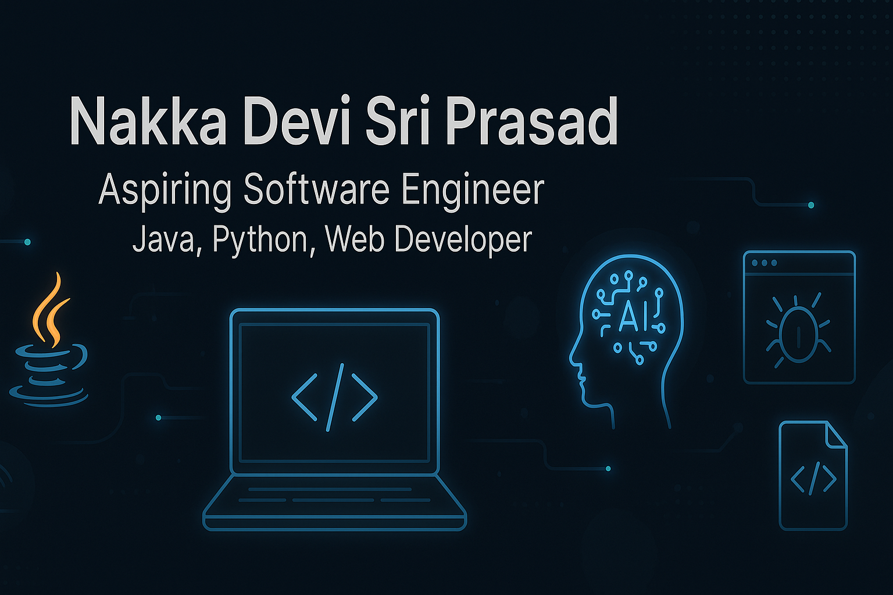

## Hi there 👋
# Hi, I'm Nakka Devi Sri Prasad

### Aspiring Software Engineer | Java, Python & Web Development Enthusiast

I'm passionate about building impactful software and learning new technologies. Currently working on cool projects like a Smart Home Automation System and an AI Resume Screener to level up my skills and land my first internship.

---

### 🚀 Tech Stack:
- **Languages**: Java, Python, HTML, CSS, JavaScript
- **Web Dev**: React.js, Node.js (learning), Express.js
- **Tools & Platforms**: Git, GitHub, VS Code, Postman
- **Learning**: Machine Learning, Embedded Systems, APIs

---

### 🛠️ Projects I'm working on:
- Smart Home Automation System
- AI-Powered Resume Screener
- Bug Tracker Web App
- Face Recognition Attendance System
- Portfolio Website + Blog

Stay tuned — I’ll be uploading them all here soon!

---

### 📫 Connect with me:
- Email: *nakkadevisriprasad004@gmail.com*

---

<!--
**Dsp023/Dsp023** is a ✨ _special_ ✨ repository because its `README.md` (this file) appears on your GitHub profile.

Here are some ideas to get you started:

- 🔭 I’m currently working on ...
- 🌱 I’m currently learning ...
- 👯 I’m looking to collaborate on ...
- 🤔 I’m looking for help with ...
- 💬 Ask me about ...
- 📫 How to reach me: ...
- 😄 Pronouns: ...
- ⚡ Fun fact: ...
-->
