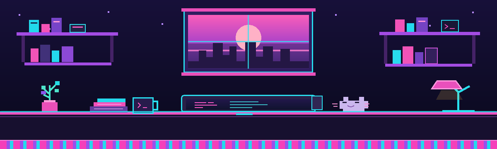

<!-- ═══════════════ HEADER ═══════════════ -->
<div align="center">


<br/>

<a href="https://linkedin.com/in/devi-sri-prasad-nakka-68026b333">
  
</a>
<a href="mailto:nakkadevisriprasad004@gmail.com">
  
</a>
<a href="https://github.com/Dsp023">
  
</a>

</div>

<br/>

<!-- ═══════════════ ABOUT ═══════════════ -->
## `~/about`

```bash
$ cat devi.json
{
  "name":     "Devi Sri Prasad",
  "role":     "AI Systems-focused Software Developer",
  "location": "Hyderabad, India",
  "focus":    ["Backend Systems", "LLM Integrations", "Automation Workflows"],
  "building": "clean, scalable web applications",
  "open_to":  ["Software Engineer roles", "Backend Internships"],
  "mantra":   "build calm. learn deeply. create boldly."
}
```

<br/>

<!-- ═══════════════ STACK ═══════════════ -->
## `~/stack`

<div align="center">
  
</div>

<br/>

<!-- ═══════════════ NOW ═══════════════ -->
## `~/now`

```diff
+ Building   → reliable backend systems & LLM-powered tooling
+ Learning   → scalable architecture, system design, AI agents
+ Exploring  → multi-provider AI workflows & automation pipelines
+ Sharpening → DSA, clean code, and open-source collaboration
```

<br/>

<!-- ═══════════════ STATS ═══════════════ -->
## `~/stats`

<div align="center">


<br/><br/>

</div>

<br/>

<!-- ═══════════════ ACTIVITY ═══════════════ -->
## `~/activity`

<div align="center">
  
</div>

<br/>

<!-- ═══════════════ FOOTER ═══════════════ -->
<div align="center">
  
</div>
